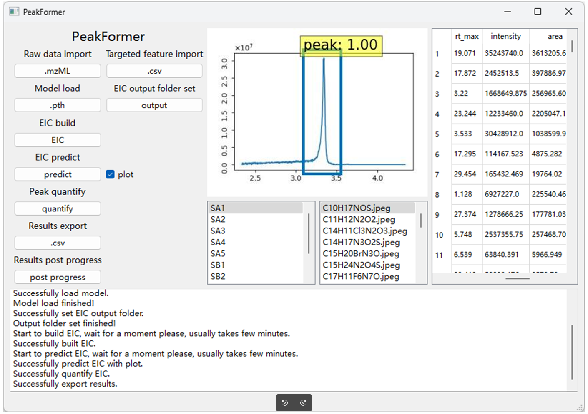

# PeakFormer

#### Description
PeakFormer is a novel approach written in Python (v3.8.1) for peaks (aka features) detection 
and quantification in raw LC-MS data. The main idea of this method is to train object detection network combining 
CNN and Transformer to identify the peaks in EIC (to judge whether it is a true peak or a false peak) and 
locate the peak boundaries to integrate the area. The current method is developed for high-resolution LC-MS data for 
metabolomics purposes, but it can also be applied to other detections that take peaks as the targets.


Supported formats:

.mzML

### Operating System Compatibility
PeakFormer has been tested successfully with:
- Windows 10
- Windows 11
- Ubuntu 20.04
- macOS Sonoma


### Installing and running the application
To install and run PeakFormer you should do a few simple steps:
1. clone the repository:
   ```python
   numpy==1.24.4
   pymzml==2.5.10
   joblib==1.4.2
   pandas==2.0.3
   natsort==8.4.0
   scipy==1.10.1
   matplotlib==3.7.5
   torchvision==0.18.1
2. install requirements in the following automated way (or you can simply open reqirements.txt file and download listed libraries in any other convenient way):
    ```python
   pip install -r requirements.txt
3. prepare mzML files in the mzML folder and feature.csv
   ```python
   ├── mzML
      ├── BC1.mzML 
      ├── BC2.mzML
      └── BC3.mzML
   
   feature.csv contains the following columns:
   1. Compound Name(numbers)
   2. mz
   3. RT
4. PeakFormer can be used in command line mode and GUI mode under Windows.
   1. command line mode:
       ```python
       python main.py --source resources/example/mzML --feature resources/example/faeture.csv --images_path resources/example/peak-output --output_path resources/example/peak-output/area.csv 
   2. GUI mode:
       ```python
       python ./GUI/ms-main.py

     
The more detailed instruction on how to train and run the new model is available via the link.